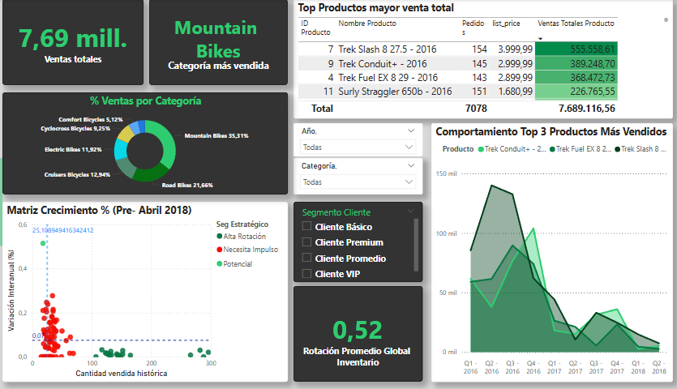
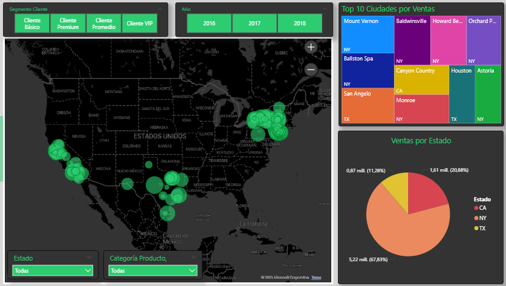
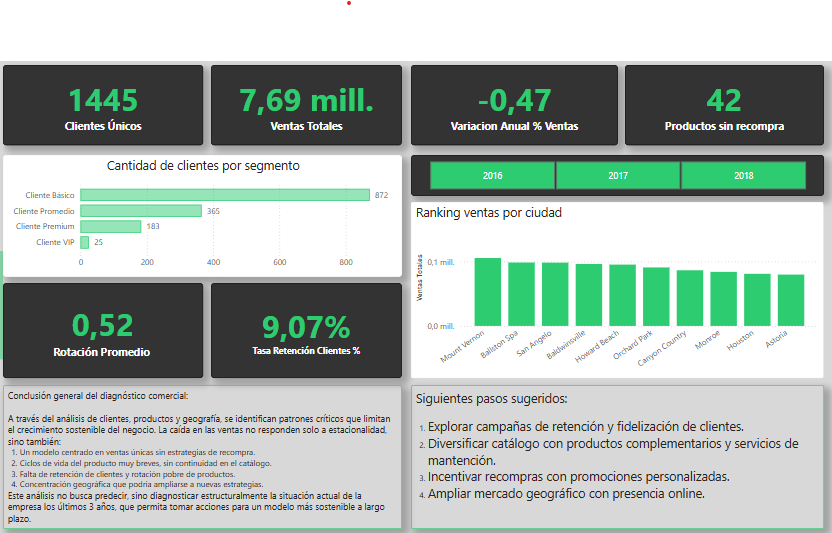

# Fase 2: Análisis en Power BI

Modelo de Datos en Power BI

Se importó el modelo Estrella desarrollado en MySQL, con los mismos roles. Inicialmente no se tuvieron que hacer cambios importantes en
Power Query, dada la limpieza hecha en la herramienta ya mencionada.

Medidas principales en DAX

Se realizaron medidas con el lenguaje DAX para sacar métricas claves de negocio. Las más destacables son:

-Segmento Ticket Promedio: donde clasificamos a los clientes en base a su monto de compra, formando 4 clasificaciones (VIP, Premium, Promedio y Básico)

-Ventas Totales: la clásica multiplicación de precio por cantidad, añadiéndole el descuento correspondiente.

-Facturación promedio por cliente: una medida que divide las ventas totales por el total de clientes.

-Rotación promedio de inventario: representa cuantas veces las ventas de la empresa superaron su inversión en inventario.

Estas y demás medidas destacables se ahondarán en los análisis clientes, productos, geográficos y conclusiones.

# Análisis de Clientes

En el análisis de clientes, podemos observar métricas como Facturación Promedio por Cliente, Top 10 Clientes por Ventas, cantidad de clientes por segmento (clasificando por facturación) y el comportamiento de ventas totales con granularidad año-mes. Al interactuar con estos gráficos dinámicos, se puede observar que la mayoria de nuestra ventas provenían desde un principio de nuestros clientes Básico y Promedio (facturación menor a $10.000 USD), pero al pasar los años, los clientes tipo Premium y VIP empiezan a tomar un porcentaje importante de nuestro total de ventas, que puede señalar los esfuerzos de la empresa por vender productos de una gama superior. Respecto al comportamiento de las ventas, si bien no se puede decir con exactitud que existe un comportamiento cíclico, sí existe un patrón heterogéneo. La particularidad está en que, desde abril de 2018, hubo un pick importante de ventas a nivel histórico, para luego tener una caída brutal hasta fin de año.

Las principales medidas DAX de este análisis fueron:

Facturación Promedio por Cliente: usando las funciones DIVIDE, SUM Y DISTINCT COUNT sobre columnas de la tabla Hechos y Clientes.

Ventas Totales: usando la función SUMX para multiplicar horizontalmente las 3 columnas que conforman las ventas.

Cliente Top Cantidad Dinámico: una medida que exhibe el cliente que nos ha comprado la mayor cantidad de productos (de manera histórica y por período). Usa funciones como SUMMARIZE, TOPN, SELECTCOLUMNS, CALCULATE, MAX y FILTER, junto con la creación de variables (VAR).

Clientes Segmentados Visual: se basa en la segmentación por ticket promedio ya descrita, pero se añaden funciones para poder hacer la visualización dinámica. Es necesario usar CALCULATE, DISTINCTCOUNT, VALUES Y SWITCH, de manera de poder ver la evolución de la segmentación por años.

# Análisis Producto

Respecto al Análisis Producto, podemos observar métricas como ventas totales, categoría de producto más vendida, Top Productos por mayor venta total, porcentaje de ventas por categoría, comportamiento top 3 productos más vendidos, rotación promedio global de inventario y la matriz de crecimiento porcentual (pre abril 2018). Estas visualizaciones dinámicas nos ofrecen información complementaria con el análisis clientes: en este caso, podemos observar que la categoría más vendida en términos globales son las Mountain Bikes, con un 35,31%. Podemos observar también que la marca Trek es la líder en ventas de esta tienda, consolidándose en los segmentos promedio, premium y VIP. Podemos ver que el comportamiento de los 3 productos más vendidos ha ido reduciéndose notablemente al pasar los quarters. Tenemos una rotación promedio global de inventario de 0.52, lo que señala que las ventas del giro de esta empresa representaron 0.52 veces lo que la empresa invirtió en sus inventarios. Este ratio se puede profundizar con la matriz de crecimiento porcentual, la cual se asemeja a una matriz BCG, pero en vez de hablar de participación relativa de mercado y crecimiento en ventas, hablamos de cantidad vendida histórica del producto y variación interanual de ventas (%). Bajo estos ejes, se definen 4 segmentos estratégicos de productos:

-Producto Estrella: producto que posee una variación interanual de ventas superior a la media, y una cantidad de ventas histórica superior a la media. Estos productos son y han sido populares por un tiempo considerable, y poseen un comportamiento creciente en sus ventas. 

-Producto Potencial: producto que posee una variación interanual de ventas superior a la media, y una cantidad de ventas histórica inferior a la media. Estos productos muestran un crecimiento reciente de sus ventas, pero no han sido explotados en su totalidad.

-Producto Alta Rotación: producto que posee una variación interanual de ventas inferior a la media, y una cantidad de ventas histórica superior a la media. Estos productos han sido demandados históricamente por los segmentos de clientes, pero muestran una variación interanual de crecimiento de ventas decreciente. Son productos que se compran pero cada vez menos, y que le sirven a la empresa como fuente de liquidez temporal.

-Producto "Necesita Impulso": producto que posee una variación interanual de ventas inferior a la media, y una cantidad de ventas histórica inferior a la media. Estos productos decrecen, y a la vez no son ni han sido populares entre los clientes. Pueden corresponder a productos de una gama muy especial o con un comportamiento atípico en las ventas.

Fijándonos en la matriz, hay que tomar en cuenta el siguiente supuesto: se eliminó de su construcción la información posterior a abril de 2018, donde sucede la abismal caída en las ventas, de manera de capturar el comportamiento de los productos antes de un evento que podríamos considerar irregular. Sin embargo, aún bajo este supuesto, la mayoría de productos de la compañía caen en la categoría de productos que necesitan impulso: baja cantidad histórica vendida y variación interanual decreciente en las ventas. Esta es una señal de alarma para la compañía, y confirma el comportamiento del año 2018: la empresa tiene un comportamiento errático y decreciente en sus ventas, lo que podemos corroborar al comparar las ventas de 2016 (2,43 millones de USD), 2017 (3,45 millones de USD) y 2018 (1,81 millones de USD). La mayoría de sus productos rotan poco y venden poco respecto a la media, y si bien hablamos de bicicletas (producto duradero de compra comparada) una rotación baja y ventas decrecientes (que después de condicen con poca retención y fidelización) no es deseable. A su vez, la empresa cuenta con solo 1 producto potencial, y ningún producto estrella, lo cual está en línea con lo anterior.

Las principales medidas DAX de este análisis fueron:

-Categoría más vendida: medida que nos muestra la categoría top. Usa SUMMARIZE, MAXX, CALCULATE Y FILTER, junto con la creación de variables.

-Ventas totales (ya explicadas en análisis cliente).

-Comportamiento Top 3 Productos más vendidos: si bien esta es una tabla y no una medida, requierió de la creación de una tabla "Calendario", fundamental para hacer análisis de tiempo. En esta tabla se definen distintas granularidades de fecha para personalizar comportamientos temporales. Se relaciona con nuestra tabla de Hechos mediante Date.

-Rotación Promedio Global Inventario: para este ratio, se adaptó la razón clásica de rotación con las ventas y el inventario (dado que no contamos con el costo de ventas). Usa CALCULATE, SUM Y DIVIDE.

-Matriz Crecimiento %: se usan 3 medidas principales -> 
Cantidad_Total_Vendida: donde usamos un SUM con order_quantity filtrando por Calendario[date] para tomar valores anteriores a abril de 2018.

->Variación interanual Dinámica: donde tomamos medidas de ventas que seleccionan meses particulares para que se comparen de forma interanual. Para ello se usan funciones como SAMEPERIODLASTYEAR y KEEPFILTERS.

->Segmento_Estratégico: donde es necesario hacer un SWITCH para clasificar a los productos según los ejes definidos por la matriz, y usando las 2 medidas anteriores.

# Análisis Geográfico

Respecto al análisis geográfico, podemos visualizar la concentración de clientes en los 3 estados en los que opera la tienda: California (CA) Texas (TX) y Nueva York (NY). Se puede ver que la ciudad con mayores ventas de manera histórica es Mount Vernon, y que la mayoría de las ciudades con mayores ventas provienen de NUeva York, que se lleva el 67.83% de los clientes en total. Podemos filtrar por segmento de clientes y categoría de producto, para saber el comportamiento particular de cada grupo. 

En este análisis geográfico, al ser más visual, no se calcularon nuevas medidas respecto a los análisis anteriores. Sin embargo, fue necesario concatenar correctamente la ciudad con el estado para que el motor de geolocalización de Bing pudiera identificar correctamente la ubicación de los clientes. Un análisis más certero podría haber sido usar la dirección exacta de cada cliente, pero para ello eran necesarias herramientas externas a Power BI, lo cual representa una limitación en este análisis.

# Conclusiones 

