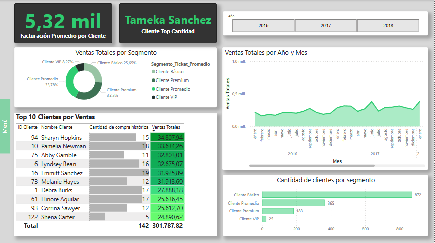

# Fase 2: Análisis en Power BI

Modelo de Datos en Power BI

Se importó el modelo Estrella desarrollado en MySQL, con los mismos roles. Inicialmente no se tuvieron que hacer cambios importantes en
Power Query, dada la limpieza hecha en la herramienta ya mencionada.

Medidas principales en DAX

Se realizaron medidas con el lenguaje DAX para sacar métricas claves de negocio. Las más destacables son:

-Segmento Ticket Promedio: donde clasificamos a los clientes en base a su monto de compra, formando 4 clasificaciones (VIP, Premium, Promedio y Básico)

-Ventas Totales: la clásica multiplicación de precio por cantidad, añadiéndole el descuento correspondiente.

-Facturación promedio por cliente: una medida que divide las ventas totales por el total de clientes.

-Rotación promedio de inventario: representa cuantas veces las ventas de la empresa superaron su inversión en inventario.

Estas y demás medidas destacables se ahondarán en los análisis clientes, productos, geográficos y conclusiones.

# Análisis de Clientes

En el análisis de clientes, podemos observar métricas como Facturación Promedio por Cliente, Top 10 Clientes por Ventas, cantidad de clientes por segmento (clasificando por facturación) y el comportamiento de ventas totales con granularidad año-mes. Se puede observar que,

